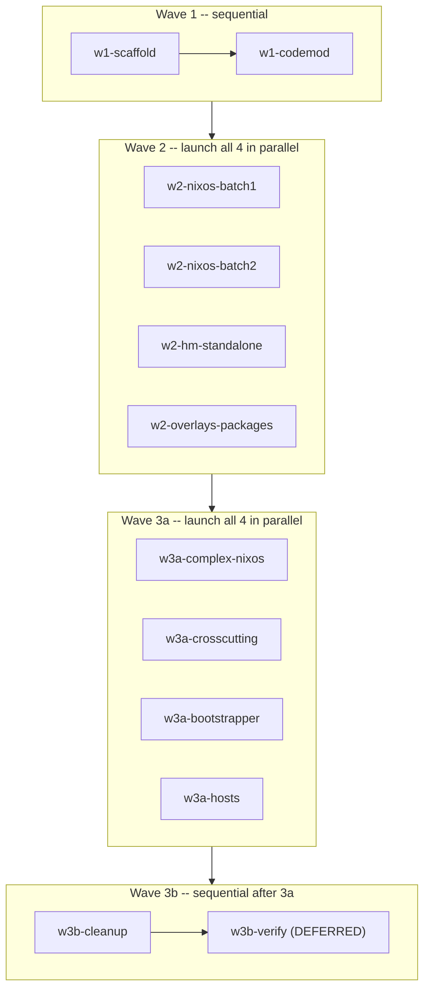

# Snowfall-lib to Dendritic Pattern Migration

## Important Constraints

- **Upgrade in progress:** Do NOT run `nix build`, `nixos-rebuild`, or `nix flake update` until the user confirms the upgrade is complete. Verification builds are deferred.
- **Feature branch:** All work on a branch based on `dendritic-migration-2026`.
- **Parallelization:** Wave 2 and Wave 3a todos can each be launched simultaneously via "Build in new agent". Within each wave, agents touch disjoint files. Wave 3b (cleanup) runs only after ALL Wave 3a agents are done.

---

## Commit Guidelines

Every agent must follow these rules for every commit it makes:

### Format: Conventional Commits

```
<type>(<scope>): <short description>
```

Types:
- `build` -- changes to flake.nix, flake.lock, or build infrastructure
- `refactor` -- converting existing modules to dendritic pattern (no behaviour change)
- `feat` -- new modules or capabilities that did not exist before
- `chore` -- deletions, renames, cleanup

Examples:
```
build(flake): migrate to flake-parts + import-tree
refactor(nixos): convert enableableModule batch via codemod
refactor(nixos/desktop): convert to inheritance aspect
feat(nixos/home-manager): add HM bootstrapper module
chore: delete _old-modules, lib, overlays, systems, packages
```

### Atomic staging: NEVER use `git add .` or `git add -A`

Each agent only stages the specific files it created or modified. In Wave 2 and Wave 3a, four agents write to disjoint files simultaneously -- if any agent uses `git add .` it will steal another agent's uncommitted work.

Always stage by explicit path:
```bash
git add modules/appimage.nix modules/avahi.nix modules/beets.nix ...
```

Or by directory for tasks that own a whole subdirectory (e.g. overlays + packages agent owns `modules/overlays.nix` and `modules/beetcamp/`):
```bash
git add modules/overlays.nix modules/beetcamp/
```

### When to commit

Each agent makes **one commit per logical unit of work**:

| Todo | Commit point | Scope |
|------|-------------|-------|
| w1-scaffold | After creating branch, rewriting flake.nix, renaming modules/, creating systems.nix | all changed files |
| w1-codemod | After running the codemod script and verifying all 16 output files exist | codemod script + all generated modules/*.nix |
| w2-nixos-batch1 | After writing all 13 modules | modules/appimage.nix … modules/nix.nix |
| w2-nixos-batch2 | After writing all 13 modules | modules/nvidia.nix … modules/yubikey.nix |
| w2-hm-standalone | After writing all 8 modules (+ companion files) | modules/bash.nix … modules/vim/ |
| w2-overlays-packages | After writing overlays.nix and beetcamp/ | modules/overlays.nix modules/beetcamp/ |
| w3a-complex-nixos | After writing all complex + grouping modules (including desktop HM side) | modules/desktop.nix modules/gaming.nix modules/router/ modules/common.nix modules/architecture.nix modules/reverse-proxy.nix modules/geoclue.nix modules/steam.nix |
| w3a-crosscutting | After merging darkman + ssh cross-cutting modules and updating xdg-portal | modules/darkman.nix modules/ssh.nix modules/xdg-portal.nix |
| w3a-bootstrapper | After creating home-manager.nix | modules/home-manager.nix |
| w3a-hosts | After writing all 7 host files | modules/hosts/ |
| w3b-cleanup | After all deletions and CLAUDE.md update | deleted paths + CLAUDE.md |

### Checking for conflicts before committing

Before staging, always run `git status` to confirm that only your expected files are untracked/modified. If you see files outside your ownership listed as modified, do NOT stage them -- leave them for the agent that owns them.

---

## Current State

- **Framework:** snowfall-lib (`snowfall-lib.mkFlake`)
- **7 hosts** across 3 architectures (5x x86_64-linux, 1x aarch64-linux, 1x x86_64-install-iso)
- **53 NixOS modules** under `modules/nixos/` using `aiden.modules.<name>.enable` / `enableableModule`
- **12 home-manager modules** under `modules/home/` (mostly always-on, no enable gates)
- **1 overlay** pulling packages from unstable/pinned channels
- **1 custom package** (beetcamp)
- **lib/aiden/** with `enableableModule`, `toLocalReverseProxy`, `mkReverseProxyAppsOption`

## Target State

- **Framework:** flake-parts + import-tree
- Every `.nix` file under `modules/` is a flake-parts module
- No `aiden.modules.<name>.enable` gating -- features composed via `imports`
- Cross-cutting concerns unified into single files with both `flake.modules.nixos.`* and `flake.modules.homeManager.`*
- Hosts defined as direct `flake.nixosConfigurations.<hostname>` via `nixosSystem` calls

---

## Execution Order




---

## NixOS Module Conversion Rules (referenced by Wave 1 and Wave 2 todos)

### Before/after: enableableModule pattern (17 modules, handled by codemod)

BEFORE (`_old-modules/nixos/ssh/default.nix`):

```nix
params@{
  pkgs,
  lib,
  config,
  ...
}:
with lib.aiden;
enableableModule "ssh" params {
  services.openssh = {
    enable = true;
    openFirewall = true;
    settings = {
      PasswordAuthentication = false;
      KbdInteractiveAuthentication = false;
    };
  };
  users.users.aiden.openssh.authorizedKeys.keys = [
    "ssh-ed25519 AAAAC3NzaC1lZDI1NTE5AAAAIIgHxgT0rlJDXl+opb7o2JSfjd5lJZ6QTRr57N0MIAyN aiden@lars"
    "ssh-ed25519 AAAAC3NzaC1lZDI1NTE5AAAAILCoq4Vfco724r3Ogg0s2fijnu9GtDsDW/e5JsKAQOzf"
  ];
}
```

AFTER (`modules/ssh.nix`):

```nix
{ ... }:
{
  flake.modules.nixos.ssh =
    { pkgs, lib, config, ... }:
    {
      services.openssh = {
        enable = true;
        openFirewall = true;
        settings = {
          PasswordAuthentication = false;
          KbdInteractiveAuthentication = false;
        };
      };
      users.users.aiden.openssh.authorizedKeys.keys = [
        "ssh-ed25519 AAAAC3NzaC1lZDI1NTE5AAAAIIgHxgT0rlJDXl+opb7o2JSfjd5lJZ6QTRr57N0MIAyN aiden@lars"
        "ssh-ed25519 AAAAC3NzaC1lZDI1NTE5AAAAILCoq4Vfco724r3Ogg0s2fijnu9GtDsDW/e5JsKAQOzf"
      ];
    };
}
```

### Before/after: manual mkEnableOption pattern (handled by Wave 2)

BEFORE (`_old-modules/nixos/pipewire/default.nix`):

```nix
params@{
  lib,
  pkgs,
  config,
  ...
}:
with lib;
let
  moduleName = "pipewire";
in
{
  options = {
    aiden.modules.pipewire.enable = mkEnableOption moduleName;
  };
  config = mkIf config.aiden.modules.pipewire.enable {
    services.pipewire.enable = true;
    security.rtkit.enable = true;
  };
}
```

AFTER (`modules/pipewire.nix`):

```nix
{ ... }:
{
  flake.modules.nixos.pipewire =
    { lib, pkgs, config, ... }:
    {
      services.pipewire.enable = true;
      security.rtkit.enable = true;
    };
}
```

### Transformation rules (apply to ALL module conversions)

1. The **outer function** `{ ... }:` is the flake-parts module. Add `inputs` to its args ONLY if the inner body references `inputs.`* anywhere (imports, package refs, etc.).
2. The **inner function** `{ lib, pkgs, config, ... }:` is the NixOS module. Keep the same args it had before (minus `params@` and `inputs` -- `inputs` is captured from the outer closure).
3. `**with lib;` placement**: If the old module uses bare `mkIf`, `mkOption`, `mkEnableOption`, `types`, `mkMerge`, `optionals`, etc., put `with lib;` BETWEEN the inner function args and the opening brace of the module body:

```nix
   { ... }:
   {
     flake.modules.nixos.mymodule =
       { lib, pkgs, config, ... }:
       with lib;       # <-- here, after args, before body
       {
         options.foo = mkOption { ... };
         config = mkIf bar { ... };
       };
   }
   

```

1. `**with pkgs;` placement**: If the old module uses `with pkgs;`, put it in the same position (after inner args, alongside `with lib;`):

```nix
   { ... }:
   {
     flake.modules.nixos.gaming =
       { lib, pkgs, config, ... }:
       with lib;
       with pkgs;      # <-- alongside with lib;
       {
         ...
       };
   }
   

```

1. **Strip** the `options.aiden.modules.<name>.enable` declaration entirely.
2. **Unwrap** the `mkIf config.aiden.modules.<name>.enable { ... }` -- keep only the body.
3. **Remove** `with lib.aiden;` entirely.
4. **Remove** lines like `aiden.modules.foo = enabled;` or `aiden.modules.foo.enable = true;` -- feature composition is now done at the host level via imports.
5. **EXCEPTION:** If a module sets options on another module that are NOT just `.enable` (e.g., `aiden.modules.geoclue.apps.darkman = { ... }`), keep those lines.
6. If the module has options BEYOND just `enable`, preserve them (but move the option namespace -- they can keep using `aiden.modules.<name>.`* or be simplified).
7. `**inputs` rule**: Read the old module's function arguments. If they include `inputs`, OR the module body references `inputs.`* anywhere, add `inputs` to the OUTER flake-parts function: `{ inputs, ... }:`. Do NOT add `inputs` to the inner NixOS module args -- it is captured by the closure.

### HM module conversion pattern

BEFORE (`_old-modules/home/bash/default.nix`):

```nix
{ config, pkgs, lib, ... }:
{
  programs.bash.enable = true;
  programs.bash.initExtra = "set -o vi";
}
```

AFTER (`modules/bash.nix`):

```nix
{ ... }:
{
  flake.modules.homeManager.bash =
    { config, pkgs, lib, ... }:
    {
      programs.bash.enable = true;
      programs.bash.initExtra = "set -o vi";
    };
}
```

For modules with companion files, use directory form: `modules/<name>/default.nix` + `modules/<name>/<companion>`. Relative paths like `./vimrc` continue to work.

---

## Wave 1: Sequential Foundation

### Step 1: Scaffold (todo: w1-scaffold)

1. Create feature branch:

```bash
git checkout -b dendritic-migration dendritic-migration-2026
```

1. Rewrite `flake.nix`:

```nix
{
  nixConfig = {
    extra-substituters = [
      "https://cache.nixos.org"
      "https://cachix.cachix.org"
      "https://nixpkgs.cachix.org"
      "https://nix-community.cachix.org"
      "https://cache.flox.dev"
    ];
    trusted-public-keys = [
      "cachix.cachix.org-1:eWNHQldwUO7G2VkjpnjDbWwy4KQ/HNxht7H4SSoMckM="
      "nixpkgs.cachix.org-1:q91R6hxbwFvDqTSDKwDAV4T5PxqXGxswD8vhONFMeOE="
      "cache.nixos.org-1:6NCHdD59X431o0gWypbMrAURkbJ16ZPMQFGspcDShjY="
      "nix-community.cachix.org-1:mB9FSh9qf2dCimDSUo8Zy7bkq5CX+/rkCWyvRCYg3Fs="
      "flox-cache-public-1:7F4OyH7ZCnFhcze3fJdfyXYLQw/aV7GEed86nQ7IsOs="
      "cache.nixos.org-1:6NCHdD59X431o0mWqyPMV+FnfCelaCYkFdeVX6Ht7cg="
    ];
  };
  inputs = {
    flake-parts = {
      url = "github:hercules-ci/flake-parts";
      inputs.nixpkgs-lib.follows = "nixpkgs";
    };
    import-tree.url = "github:vic/import-tree";
    nixpkgs.url = "github:nixos/nixpkgs/nixos-25.11";
    nixpkgs-stable.url = "github:nixos/nixpkgs/nixos-25.11";
    nixpkgs-unstable.url = "github:nixos/nixpkgs/nixpkgs-unstable";
    # ... preserve all other inputs EXCEPT snowfall-lib and nixpkgs-unstable-pinned ...
    nixos-hardware.url = "github:NixOS/nixos-hardware/master";
    home-manager = {
      url = "github:nix-community/home-manager/release-25.11";
      inputs.nixpkgs.follows = "nixpkgs";
    };
    # ... nur, firefox-addons, microvm, dwm, nixos-generators, disko, agenix,
    #     nixos-facter-modules, nixos-facter, nixos-images, jovian, switch-fix ...
  };
  outputs = inputs:
    inputs.flake-parts.lib.mkFlake { inherit inputs; } {
      imports = [ (inputs.import-tree ./modules) ];
    };
}
```

1. Rename `modules/` to `_old-modules/` (underscore = ignored by import-tree).
2. Create `modules/systems.nix`:

```nix
{ ... }:
{
  systems = [ "x86_64-linux" "aarch64-linux" ];
}
```

1. Commit.

### Step 2: Codemod (todo: w1-codemod)

Write a bash script that converts the 17 `enableableModule` modules. These all match this exact pattern:

```
params@{ <args> }:
with lib.aiden;
enableableModule "<name>" params {
  <config body>
}
```

The script should:

1. For each name in: adguard android barrier cli-base coreboot emacs gc ios php-docker printer redshift scala ssh thunar traefik transmission (NOTE: steam is excluded -- it references `inputs` and is handled in Wave 3 w3-complex-nixos)
2. Read `_old-modules/nixos/<name>/default.nix`
3. Extract the module name from `enableableModule "<name>"`
4. Extract the config body between the `{` after `params` and the final `}`
5. Write `modules/<name>.nix` wrapping in the dendritic pattern (see before/after above)
6. Copy any companion files if they exist in the source directory

Commit the script and its output.

---

## Wave 2: Parallel Module Conversion (launch all 4 todos simultaneously)

### Task 1: NixOS batch 1 (todo: w2-nixos-batch1)

Convert from `_old-modules/nixos/<name>/default.nix` to `modules/<name>.nix`:

**appimage, avahi, beets, flatpak, hardware-acceleration, home-assistant, jellyfin, jovian, keyd, locale, multimedia, navidrome, nix**

Per-module quirks:

- **beets**: uses `aiden.programs.beets.enable` (not `aiden.modules`). References `inputs.self.packages.x86_64-linux.beetcamp` -- add `inputs` to outer function args: `{ inputs, ... }:`.
- **jellyfin**: do NOT reference any overlay. Use standard nixpkgs jellyfin. Remove `aiden.modules.hardware-acceleration.enable = true;` line (that's host-level composition now).
- **home-assistant**: may reference `inputs` for Podman/container config and `config.age.secrets` for mosquitto -- keep secret refs, add `inputs` to outer args if needed.
- **navidrome**: may reference reverse-proxy `apps` option -- keep those config lines.
- **locale**: may reference/enable keyd -- remove the `aiden.modules.keyd.enable` line.
- **nix**: references `inputs` for nixpkgs path (`inputs.nixpkgs`, `inputs.disko`) -- add `inputs` to outer args: `{ inputs, ... }:`.

**Reminder for ALL modules in this batch:** Apply transformation rule 11. Check each old file's function args and body. If `inputs` appears anywhere, the outer function must be `{ inputs, ... }:` not `{ ... }:`.

### Task 2: NixOS batch 2 (todo: w2-nixos-batch2)

Convert from `_old-modules/nixos/<name>/default.nix` to `modules/<name>.nix`:

**nvidia, oblivion-sync, openttd, paperless, pipewire, powermanagement, samba, scanner, syncthing, tailscale, virtualisation, xdg-portal, yubikey**

Per-module quirks:

- **paperless**: old dir is misspelled `_old-modules/nixos/paperles/`. Name new file `modules/paperless.nix`. Do NOT reference any overlay -- use standard nixpkgs `paperless-ngx`. Old file references `inputs.nixpkgs-unstable-pinned` -- remove that, use standard nixpkgs instead. Add `inputs` to outer args ONLY if the module still needs it after removing the pin.
- **openttd**: uses `aiden.programs.openttd.enable` (not `aiden.modules`).
- **xdg-portal**: convert NixOS side only (no HM side -- see Wave 3 cross-cutting for resolution). The darkman-specific portal lines (`org.freedesktop.impl.portal.Settings = [ "darkman" ]` and `extraPortals = [ pkgs.darkman ]`) should be REMOVED from xdg-portal -- they live in the HM darkman module instead.
- **tailscale**: may reference agenix secrets -- keep those references.

**Reminder for ALL modules in this batch:** Apply transformation rule 11. Check each old file's function args and body. If `inputs` appears anywhere, the outer function must be `{ inputs, ... }:` not `{ ... }:`.

### Task 3: HM standalone (todo: w2-hm-standalone)

Convert from `_old-modules/home/<name>/default.nix`:

**bash, easyeffects, firefox, git, gpg-agent, ideavim, tmux, vim**

Modules with companion files -- use directory form and copy companions:

- `firefox`: `_old-modules/home/firefox/tridactylrc` -> `modules/firefox/default.nix` + `modules/firefox/tridactylrc`
- `git`: `_old-modules/home/git/gitignore` -> `modules/git/default.nix` + `modules/git/gitignore`
- `ideavim`: `_old-modules/home/ideavim/ideavimrc` -> `modules/ideavim/default.nix` + `modules/ideavim/ideavimrc`
- `tmux`: `_old-modules/home/tmux/tmux.conf` -> `modules/tmux/default.nix` + `modules/tmux/tmux.conf`
- `vim`: `_old-modules/home/vim/vimrc` -> `modules/vim/default.nix` + `modules/vim/vimrc`

Without companions (single file): `bash`, `easyeffects`, `gpg-agent` -> `modules/<name>.nix`

Quirks:

- **easyeffects**: has `enable = false` -- preserve that.
- **darkman HM module**: do NOT convert -- handled in Wave 3 cross-cutting.
- **desktop HM module**: do NOT convert -- handled in Wave 3 cross-cutting.
- **xdg-portal HM module**: do NOT convert -- handled in Wave 3 cross-cutting.
- **ssh HM module**: do NOT convert -- handled in Wave 3 cross-cutting.

### Task 4: Overlays + packages (todo: w2-overlays-packages)

**Overlay:** Read `overlays/default.nix` (at repo root). Create `modules/overlays.nix`:

```nix
{ inputs, ... }:
{
  flake.overlays.default = final: prev: {
    inherit (inputs.nixpkgs-unstable.legacyPackages.${prev.system})
      bazarr steamtinkerlaunch navidrome;
    intel-media-driver-stable = inputs.nixpkgs.legacyPackages.${prev.system}.intel-media-driver;
    inherit (inputs.nixpkgs.legacyPackages.${prev.system})
      libva-vdpau-driver
      intel-compute-runtime-legacy1
      vpl-gpu-rt
      intel-ocl
      onevpl-intel-gpu;
  };
}
```

Do NOT include paperless-ngx, jellyfin, or redis.

**Beetcamp package:** Read `packages/beetcamp/default.nix`. Create `modules/beetcamp/default.nix`:

```nix
{ ... }:
{
  perSystem = { pkgs, ... }: {
    packages.beetcamp = pkgs.callPackage ./package.nix { };
  };
}
```

Copy the derivation file to `modules/beetcamp/package.nix`.

---

## Wave 3a: Parallel Integration (launch all 4 todos simultaneously)

### Step 1: Complex NixOS modules (todo: w3a-complex-nixos)

These require preserving custom options. Read each from `_old-modules/nixos/<name>/default.nix`.

#### Grouping modules: the Inheritance Aspect pattern

The old `desktop`, `gaming`, and `router` modules are "grouping" modules -- they compose multiple sub-features into a single bundle. In the old code, they did this via `aiden.modules.X = enabled;` lines. In dendritic, this composition is done via the **Inheritance Aspect** pattern: the grouping module IMPORTS its sub-modules using `imports = with inputs.self.modules.nixos; [ ... ]`.

This means:

- When a host imports `desktop`, it automatically gets ALL the sub-features (syncthing, redshift, darkman, pipewire, etc.) without listing them individually.
- The grouping module can still define its own options/config on top of what it imports.
- Sub-modules remain independently importable by other hosts that don't want the full bundle.

**desktop** (Inheritance Aspect + HM side in same file):

This file includes BOTH the NixOS and HM sides of the desktop module. The HM side is absorbed here (rather than in the crosscutting step) to avoid a write dependency between agents.

```nix
{ inputs, ... }:
{
  flake.modules.nixos.desktop =
    { lib, pkgs, config, ... }:
    with lib;
    {
      imports = with inputs.self.modules.nixos; [
        syncthing redshift darkman printer emacs thunar
        locale keyd yubikey appimage pipewire ssh avahi
        common multimedia hardware-acceleration ios cli-base
      ];

      options.aiden.modules.desktop.powermanagement.enable = mkOption {
        type = types.bool;
        default = true;
      };

      config = {
        aiden.modules.powermanagement.enable =
          config.aiden.modules.desktop.powermanagement.enable;

        programs.nm-applet.enable = true;
        services = {
          xserver.enable = true;
          envfs.enable = true;
          blueman.enable = true;
          tailscale.enable = true;
          mullvad-vpn.enable = true;
          gvfs.enable = true;
          libinput.enable = true;
          fstrim.enable = true;
        };
        security.sudo.wheelNeedsPassword = false;
        networking.networkmanager.enable = true;
        systemd.network.wait-online.enable = false;
        hardware.bluetooth.enable = true;
        environment.systemPackages = with pkgs; [
          bindfs xorg.xev
          (discord.override { withTTS = false; })
          cameractrls-gtk3 chromium xclip libreoffice
          kdePackages.okular vscode nodejs_22 claude-code
        ];
      };
    };

  flake.modules.homeManager.desktop =
    { config, pkgs, lib, ... }:
    {
      home.stateVersion = "23.05";
      xdg.enable = true;
      home.file."downloads".source = config.lib.file.mkOutOfStoreSymlink "/home/aiden/Downloads";
    };
}
```

Key points:

- The `imports` list replaces ALL the old `aiden.modules.X = enabled;` lines
- `powermanagement.enable` sub-option is KEPT (it's not just an enable gate)
- The `aiden.modules.powermanagement.enable = ...` line is KEPT because it passes a value, not just `enabled`
- `xdg-portal` is intentionally NOT in the imports list (it's handled by darkman)
- All other `aiden.modules.X = enabled;` lines are REMOVED -- they become imports instead

**gaming** (Inheritance Aspect):

```nix
{ inputs, ... }:
{
  flake.modules.nixos.gaming =
    { lib, pkgs, config, ... }:
    with lib;
    with pkgs;
    let
      cfg = config.aiden.modules.gaming;
      minecraftPackages = optionals cfg.games.minecraft.enable [ prismlauncher ];
      moonlightClient = optionals cfg.moonlight.client.enable [ moonlight-qt ];
    in
    {
      imports = with inputs.self.modules.nixos; [
        steam
        oblivion-sync
        openttd
      ];

      options.aiden.modules.gaming = {
        steam.enable = mkEnableOption "steam";
        moonlight = {
          server.enable = mkEnableOption "moonlight server";
          client.enable = mkEnableOption "moonlight client";
        };
        games = {
          oblivionSync.enable = mkEnableOption "oblivion sync";
          openttd.enable = mkEnableOption "openttd";
          minecraft.enable = mkEnableOption "minecraft";
        };
      };

      config = {
        services.sunshine = mkIf cfg.moonlight.server.enable {
          enable = true;
          openFirewall = true;
          capSysAdmin = true;
        };
        aiden.modules.steam.enable = cfg.steam.enable;
        aiden.modules.oblivionSync.enable = cfg.games.oblivionSync.enable;
        aiden.programs.openttd.enable = cfg.games.openttd.enable;
        environment.systemPackages = minecraftPackages ++ moonlightClient;
        boot.kernelParams = [ "preempt=full" ];
      };
    };
}
```

Key points:

- `imports` pulls in `steam`, `oblivion-sync`, `openttd` as sub-features
- All the sub-options (`steam.enable`, `moonlight.*`, `games.*`) are KEPT -- they gate sub-features
- The `aiden.modules.steam.enable = cfg.steam.enable;` lines are KEPT because they pass config values to sub-modules, not just `enabled`
- Note `_@` in the old file is a typo -- it should just be removed (old param destructuring artifact)

**router** (Inheritance Aspect + directory structure):

The router has 5 sub-modules. Keep them all under `modules/router/` as a directory. The main module imports the sub-modules.

`modules/router/default.nix`:

```nix
{ inputs, ... }:
{
  flake.modules.nixos.router =
    { lib, config, ... }:
    with lib;
    with config.aiden.modules.router;
    {
      imports = with inputs.self.modules.nixos; [
        router-dhcp router-dns router-firewall
        router-interfaces router-zeroconf
      ];

      options.aiden.modules.router = {
        enable = mkEnableOption "router";
        internalInterface = mkOption { type = types.str; };
        externalInterface = mkOption { type = types.str; };
        dns.enable = mkEnableOption "unbound dns";
        dnsmasq.enable = mkEnableOption "dnsmasq";
      };
    };
}
```

Each sub-module becomes its own flake-parts module file. Example `modules/router/dhcp.nix`:

```nix
{ ... }:
{
  flake.modules.nixos.router-dhcp =
    { lib, pkgs, config, ... }:
    with lib;
    let
      dnsmasqEnable = config.aiden.modules.router.dnsmasq.enable;
    in
    {
      config = mkIf dnsmasqEnable {
        # ... dhcp config body unchanged ...
      };
    };
}
```

`modules/router/firewall.nix` (has companion file `nft.nix`):

```nix
{ ... }:
{
  flake.modules.nixos.router-firewall =
    { config, lib, ... }:
    with {
      inherit (config.aiden.modules.router)
        enable internalInterface externalInterface;
    };
    {
      config = lib.mkIf enable {
        networking = {
          firewall.enable = false;
          nftables = {
            enable = true;
            ruleset = (import ./nft.nix { inherit internalInterface externalInterface; });
          };
        };
      };
  };
}
```

Copy `_old-modules/nixos/router/firewall/nft.nix` to `modules/router/nft.nix` alongside `modules/router/firewall.nix`.

Similarly: `modules/router/dns.nix`, `modules/router/interfaces.nix`, `modules/router/zeroconf.nix`.

Key: Router sub-modules are named `router-dhcp`, `router-dns`, etc. in `flake.modules.nixos.*` to avoid name collisions. They read their options from `config.aiden.modules.router.*` which the parent module defines. The `enable` gate on router sub-modules is KEPT because it's the parent router's enable, not a self-enable.

#### Other complex modules

- **common**: keep `domainName`, `email`, `publicKey` options under `aiden.modules.common.`*. Drop `enable`. The module references `inputs` for nixpkgs path -- add `inputs` to outer args. Remove `aiden.modules.gc.enable = true;` (host composition).
- **architecture**: options-only (`aiden.architecture.cpu`, `aiden.architecture.gpu`). No enable to strip.
- **reverse-proxy**: keep `apps` option. Inline `toLocalReverseProxy` and `mkReverseProxyAppsOption` from `_old-modules/../lib/aiden/default.nix` as `let` bindings.
- **geoclue**: keep `apps` and `staticLocation` options. Drop `enable`. Inner body uses `with lib;` for `mkOption`, `types`, `mkIf`.
- **steam**: uses `enableableModule` pattern BUT also references `inputs.steamtinkerlaunch`. Add `inputs` to outer args. Strip `enableableModule` wrapper but keep the config body. Uses `with pkgs;` -- place it alongside `with lib;`.

### Step 2: Cross-cutting unification (todo: w3a-crosscutting)

Merge NixOS and HM sides into unified files. Each file defines BOTH `flake.modules.nixos.<name>` and `flake.modules.homeManager.<name>`.

NOTE: desktop is NOT handled here -- its HM side is included directly in `w3a-complex-nixos` (Step 1) to avoid a file-level write dependency between parallel agents.

- **darkman**: create `modules/darkman.nix` with both:
  - `flake.modules.nixos.darkman`: geoclue config, pathsToLink. Remove the `home-manager.users.aiden` bridge line. Remove `aiden.modules.xdg-portal.enable = false;` and `aiden.modules.darkman.enable` option/mkIf. Keep the `aiden.modules.geoclue.apps.darkman` config (it sets options on another module).
  - `flake.modules.homeManager.darkman`: darkman service. Strip `aiden.modules.darkman.enable` option/mkIf. Strip `aiden.modules.xdg-portal.enable = true;` line.
  Full example:

```nix
  { ... }:
  {
    flake.modules.nixos.darkman =
      { lib, pkgs, config, ... }:
      with lib;
      {
        environment.pathsToLink = [
          "/share/xdg-desktop-portal"
          "/share/applications"
        ];
        aiden.modules.geoclue = {
          apps.darkman = {
            isAllowed = true;
            isSystem = true;
          };
        };
      };

    flake.modules.homeManager.darkman =
      { lib, pkgs, config, ... }:
      with lib;
      {
        xdg.portal = {
          config.common = {
            "org.freedesktop.impl.portal.Settings" = [ "darkman" ];
          };
          extraPortals = [ pkgs.darkman ];
        };
        services.darkman = {
          enable = true;
          settings.usegeoclue = true;
        };
      };
  }
  

```

- **ssh**: `modules/ssh.nix` already exists from codemod (NixOS side). Add `flake.modules.homeManager.ssh` from `_old-modules/home/ssh/`:

```nix
  { ... }:
  {
    flake.modules.nixos.ssh =
      { ... }:
      {
        # ... existing NixOS ssh config from codemod ...
      };

    flake.modules.homeManager.ssh =
      { config, pkgs, lib, ... }:
      {
        programs.ssh = {
          enable = true;
          enableDefaultConfig = false;
          matchBlocks = {
            "gitlab.com".identityFile = "~/.ssh/gitlab";
            "github.com".identityFile = "~/.ssh/github";
            "192.168.* 10.0.* *.local *.sw1a1aa.uk" = {
              forwardAgent = true;
              identityFile = "~/.ssh/local";
            };
            "192.168.122.*".extraOptions = {
              "StrictHostKeyChecking" = "no";
              "UserKnownHostsFile" = "/dev/null";
            };
            "*" = {
              compression = true;
              serverAliveInterval = 30;
              serverAliveCountMax = 3;
            };
          };
        };
      };
  }
  

```

- **xdg-portal**: The NixOS and HM xdg-portal modules have overlapping/conflicting portal config. Resolution: **make NixOS the single source of truth** and DELETE the HM xdg-portal module. The HM darkman module already handles the darkman-specific portal config (`org.freedesktop.impl.portal.Settings` and `extraPortals = [ pkgs.darkman ]`). The NixOS xdg-portal module handles the base portal config (gtk portal, `xdgOpenUsePortal`).
`modules/xdg-portal.nix` (NixOS only, no HM side):

```nix
  { ... }:
  {
    flake.modules.nixos.xdg-portal =
      { lib, pkgs, config, ... }:
      {
        xdg.portal = {
          enable = true;
          config.common = {
            default = [ "gtk" ];
            "org.freedesktop.impl.portal.Secrets" = [ "none" ];
            "org.freedesktop.impl.portal.Inhibit" = [ "none" ];
          };
          extraPortals = with pkgs; [ xdg-desktop-portal-gtk ];
          xdgOpenUsePortal = true;
        };
      };
  }
  

```

  The HM-side darkman-specific portal settings (`org.freedesktop.impl.portal.Settings = [ "darkman" ]` and `extraPortals = [ pkgs.darkman ]`) are already handled by `flake.modules.homeManager.darkman` above. The NixOS module's `darkman`-related portal line is dropped. No HM xdg-portal module is created.

### Step 3: HM bootstrapper (todo: w3a-bootstrapper)

Create `modules/home-manager.nix`:

```nix
{ inputs, config, ... }:
{
  flake.modules.nixos.home-manager =
    { ... }:
    {
    imports = [ inputs.home-manager.nixosModules.home-manager ];
    home-manager.useGlobalPkgs = true;
    home-manager.useUserPackages = true;
    home-manager.users.aiden.imports =
      builtins.attrValues (config.flake.modules.homeManager or {});
  };
}
```

### Step 4: Convert hosts (todo: w3a-hosts)

Each host becomes `modules/hosts/<hostname>/default.nix`. Read from `systems/<arch>/<hostname>/default.nix`. Each directly calls `nixosSystem`:

- **desktop** uses `inputs.nixpkgs-unstable.lib.nixosSystem`
- **All others** use `inputs.nixpkgs.lib.nixosSystem`

Example (mike):

```nix
{ inputs, config, ... }:
{
  flake.nixosConfigurations.mike = inputs.nixpkgs.lib.nixosSystem {
    modules = [
      ./hardware.nix
      ./disk-configuration.nix
      inputs.disko.nixosModules.disko
      inputs.nixos-facter-modules.nixosModules.facter
    ] ++ (with config.flake.modules.nixos; [
      common desktop gaming nvidia virtualisation scanner nix home-manager
    ]) ++ [
      {
      system.stateVersion = "22.05";
        nixpkgs.overlays = [ inputs.self.overlays.default ];
      }
    ];
  };
}
```

Translate `aiden.modules.<name> = enabled;` or `aiden.modules.<name>.enable = true;` into entries in the `with config.flake.modules.nixos;` list. Keep host-specific inline config (stateVersion, boot, networking, packages, agenix secrets).

Copy hardware-configuration.nix, disk-configuration.nix, disko configs, facter.json, packages.nix alongside each host's default.nix.

Per-host notes:

- **mike** (x86_64-linux) -- stable; desktop+gaming+nvidia+disko+facter; imports dwm input
- **desktop** (x86_64-linux) -- **unstable**; jovian+gaming+hardware-acceleration; has ollama/open-webui inline; has initrd network/SSH for LUKS unlock
- **gila** (x86_64-linux) -- stable; router+home-assistant+traefik+agenix(mosquitto,cloudflare,tailscale); imports switch-fix
- **bes** (x86_64-linux) -- stable; reverse-proxy+syncthing+jellyfin+paperless+navidrome+agenix(slskd); has portainer.nix
- **barbie** (x86_64-linux) -- stable; minimal, imports nixos-hardware gpd-pocket-3; Plasma 6
- **lovelace** (aarch64-linux) -- stable; agenix+tailscale+adguard; uses SD image installer module
- **installer** (x86_64-install-iso) -- stable; uses nixos-images; sets up nixos-facter overlay

## Wave 3b: Sequential Cleanup (run AFTER all Wave 3a agents complete)

### Step 5: Cleanup (todo: w3b-cleanup)

- Delete `_old-modules/`
- Delete `lib/`
- Delete `overlays/`
- Delete `systems/`
- Delete `packages/` (contents moved to modules/beetcamp/)
- Verify `snowfall-lib` and `nixpkgs-unstable-pinned` removed from flake.nix inputs
- Update `CLAUDE.md` to describe new dendritic architecture

### Step 6: Verify builds (todo: w3b-verify) -- DEFERRED

Do NOT run until user confirms system upgrade is complete.

```bash
nix build .#nixosConfigurations.mike.config.system.build.toplevel
nix build .#nixosConfigurations.desktop.config.system.build.toplevel
nix build .#nixosConfigurations.gila.config.system.build.toplevel
nix build .#nixosConfigurations.bes.config.system.build.toplevel
nix build .#nixosConfigurations.barbie.config.system.build.toplevel
nix build .#nixosConfigurations.lovelace.config.system.build.toplevel
nix build .#nixosConfigurations.installer.config.system.build.isoImage
```

Additional checks:

- `nix eval .#nixosConfigurations.desktop.config.system.nixos.release` -- should show unstable
- `nix eval .#nixosConfigurations.mike.config.system.nixos.release` -- should show 25.11
- Verify desktop.nix, darkman.nix, ssh.nix each contain both `flake.modules.nixos.*` and `flake.modules.homeManager.*`
- Verify xdg-portal.nix contains ONLY `flake.modules.nixos.*` (no HM side -- darkman-specific portal config lives in darkman.nix's HM side)
- Confirm no overlay entries for paperless-ngx or jellyfin

